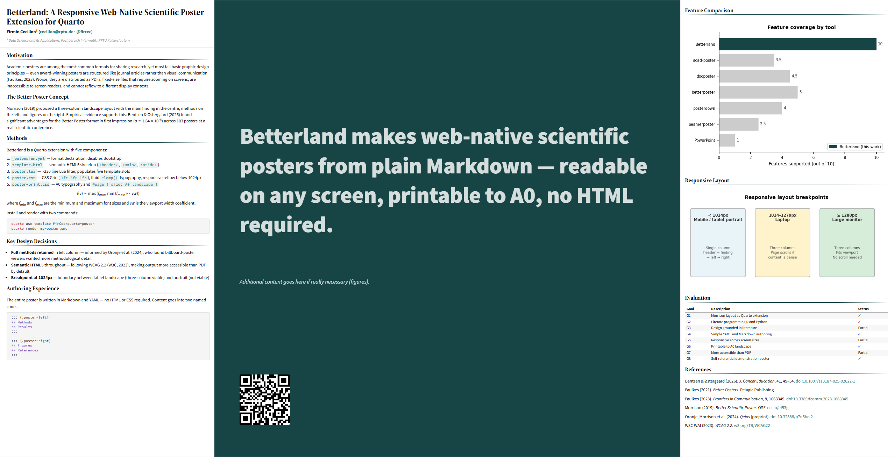

# Betterland — A Responsive Web-Native Scientific Poster Extension for Quarto

> Make web-native scientific posters from plain Markdown — readable on any screen, printable to A0, no HTML required.

Betterland is an open-source [Quarto](https://quarto.org) extension that implements
Mike Morrison's [Better Poster](https://osf.io/ef53g/) layout as a responsive HTML
document. Write your poster entirely in Markdown and YAML. Execute R or Python code
directly inside the document. Get output that works on any screen and prints
correctly to A0 landscape for physical conferences.



---

## Features

- **Morrison's three-column layout** — dominant centre column for the main finding,
  left column for methods and results, right column for figures and references
- **Responsive design** — full three-column layout on large screens and laptops,
  single-column reflow on mobile and tablets below 1024 px
- **Literate programming** — execute R or Python code chunks directly in the poster;
  figures and tables are generated reproducibly from the same source file
- **A0 print output** — centre column bleeds to page edges; typography calibrated
  for poster viewing distances
- **QR code auto-generation** — provide a URL in YAML; the QR code is generated
  in the browser with no external service required
- **Semantic HTML5** — uses `<header>`, `<main>`, `<aside>`, and `<section>`
  elements throughout; more accessible than a PDF by default
- **No HTML or CSS required** — the entire poster is written in Markdown and YAML
- **Quarto native** — install with one command, works with all Quarto computational
  engines (Python, R, Julia, Observable JS)

---

## Requirements

- [Quarto](https://quarto.org) version 1.4 or later
- Python 3 or R (optional — only needed for executable code chunks)
- A modern web browser for viewing and printing (Chrome recommended for print)

---

## Installation

In your project directory, run:

```bash
quarto use template FirCec/quarto-poster
```

This installs the extension and creates an example `.qmd` file you can use as a
starting point. To render the example poster:

```bash
quarto render example.qmd
```

Open the resulting `example.html` in your browser.

---

## Quick Start

A minimal Betterland poster looks like this:

```yaml
---
title: "Your Poster Title"

poster:
  main_finding: "**Your main finding** in plain language."
  qrcode: "https://link-to-your-paper.com"

  authors:
    - name: "Your Name"
      affil: [1]
      main: true
      email: "you@institution.edu"

  affiliations:
    - num: 1
      address: "Your Institution, Your Country"

format:
  poster-html: default
---

::: {.poster-left}

## Introduction

Your background and motivation here.

## Methods

Your methods here.

:::

::: {.poster-right}

## Results

Your figures and tables here.

## References

Your references here.

:::
```

Bold text in `main_finding` renders correctly — `**word**` produces bold white
text against the dark green background.

---

## Content Length Guidelines

Betterland is designed for A0 landscape format. When the following guidelines are
respected, the poster renders correctly on all screen sizes and prints to a single
A0 page with no content clipping:

| Zone | Recommendation |
|---|---|
| Left column | 300–400 words maximum, 4–5 sections |
| Right column | 2–3 figures or tables maximum |
| Total words | 400–600 words across both columns |

These guidelines are grounded in the poster design literature. Faulkes (2021)
recommends between 300 and 800 words for an entire poster. Morrison's original
template is even more minimal.

> **Note:** The left and right columns use `overflow: visible` in print, meaning
> content that exceeds the A0 page height is clipped at the paper edge rather than
> paginating. This is intentional — a poster is a single-page document. If your
> content is clipped, reduce it.

---

## YAML Options

All poster configuration lives under the `poster:` key in the YAML front matter.

## Custom Styling

For simple colour changes, use the YAML colour tokens described above under
**Optional styling**. For more advanced overrides, edit
`_extensions/poster/custom.scss` directly.

Any CSS rules added to the `scss:rules` section of that file will take
precedence over the extension defaults. For example, to increase the body
font size or change a heading colour:
```css
.poster-html .poster-flow {
  font-size: 13px;
}

.poster-html .poster-flow h2 {
  color: #1a1a6e;
}
```

Scope all rules under `.poster-html` to avoid unintended side effects.

### Required

| Key | Description |
|---|---|
| `main_finding` | The billboard text displayed in the centre column. Markdown bold (`**word**`) is supported. |

### Recommended

| Key | Description |
|---|---|
| `qrcode` | A URL. The QR code is generated automatically in the browser. |
| `authors` | List of author objects (see below). |
| `affiliations` | List of affiliation objects (see below). |

### Author fields

```yaml
authors:
  - name: "Author Name"
    affil: [1, 2]        # affiliation numbers
    main: true           # marks as primary author
    email: "a@b.com"
    github: username     # without the @ symbol
    orcid: "0000-0000-0000-0000"
```

### Affiliation fields

```yaml
affiliations:
  - num: 1
    address: "Department, Institution, Country"
```

### Optional styling

```yaml
poster:
  primary_color: "#0b4545"    # hero panel background
  secondary_color: "#008080"  # links and accents
  accent_color: "#cc0000"     # superscripts
  logo_left: "path/to/logo.png"
  logo_right: "path/to/logo.png"
```

---

## Content Zones

Content goes into two named Quarto div zones in the document body:

```markdown
::: {.poster-left}
Left column content — methods, results, discussion.
:::

::: {.poster-right}
Right column content — figures, tables, references.
:::
```

An optional extras zone places content in the centre column below the main finding:

```markdown
::: {.poster-extras}
Optional supplementary content in the centre column.
:::
```

---

## File Structure

```
_extensions/poster/
├── _extension.yml      # Format declaration, disables Bootstrap
├── template.html       # Full semantic HTML5 skeleton
├── poster.lua          # Lua filter — parses YAML, extracts content zones
├── poster.css          # Screen layout — CSS Grid, fluid typography, responsive
└── poster-print.css    # Print overrides — A0 typography, centre-column bleed
```

---

## Responsive Behaviour

| Viewport | Layout |
|---|---|
| ≥ 1280 px (large monitor) | Full three-column layout, fits viewport height |
| 1024–1279 px (laptop) | Full three-column layout, page scrolls if content is dense |
| < 1024 px (tablet / mobile) | Single-column reflow: header → finding → left → right → QR code |

---

## Known Limitations

**Print overflow with dense content**
The left and right columns clip content that exceeds the A0 page height. This is
by design — see the content length guidelines above.

**Device testing scope**
The responsive layout has been tested on a 27-inch monitor, a 15-inch laptop, and
a mobile viewport. Behaviour on ultrawide monitors, older browsers, or tablets in
portrait orientation has not been systematically verified.

**Accessibility audit**
The extension uses semantic HTML5 elements and follows WCAG principles, but a
formal audit against WCAG 2.2 Level AA success criteria has not been conducted.
Authors remain responsible for writing meaningful alt text for images and
maintaining adequate colour contrast when overriding the default colour scheme.

**R support**
The extension is tested with Python as the computational engine. R should work
via the `knitr` engine but has not been systematically verified.

---

## Contributing

Issues and pull requests are welcome. If you find a bug, please open an issue with
a minimal reproducible example. If you want to propose a new feature, open an issue
first to discuss it before submitting a pull request.

---

## License

This project is released under the MIT License. See `LICENSE` for details.

---

## Citation

If you use Betterland in academic work, please cite it as:

```
Cecillon, F. (2026). Betterland — A Responsive Web-Native Academic Poster Extension for Quarto
Extension for Quarto. RPTU Kaiserslautern. https://github.com/FirCec/quarto-poster
```

Or in BibTeX:

```bibtex
@misc{cecillon2026betterland,
  author       = {Cecillon, Firmin},
  title        = {Betterland: A Responsive Web-Native Academic Poster
                  Extension for {Q}uarto},
  year         = {2026},
  howpublished = {GitHub},
  url          = {https://github.com/FirCec/quarto-poster}
}
```

---

## Acknowledgements

Betterland builds on ideas from two earlier R Markdown implementations of the
Better Poster concept:

- [betterposter](https://github.com/GerkeLab/betterposter) by Garrick Aden-Buie —
  source of the `1fr 3fr 1fr` grid proportions, QR code generation approach, and
  four-font typographic system
- [posterdown](https://github.com/brentthorne/posterdown) by Brent Thorne —
  source of the YAML-driven main finding and rich author metadata schema

The Better Poster design concept itself is by
[Mike Morrison](https://osf.io/ef53g/).
