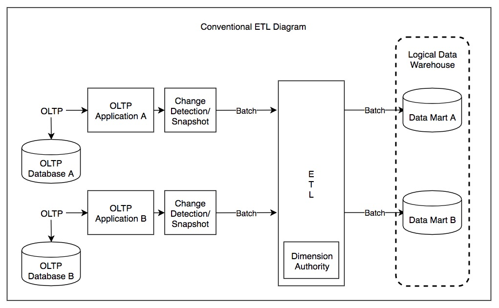

```{python}
#| echo: false
#| include: false
import matplotlib.pyplot as plt
import matplotlib
matplotlib.rcParams['figure.dpi'] = 150
plt.rcParams['figure.facecolor'] = 'none'
plt.rcParams['axes.facecolor'] = 'none'
```


<!-- ==========================================================
     LEFT COLUMN
     Place your supporting academic content here.
     Typical sections: Abstract, Methods, Results, Conclusion.
     Use ## for section headings, ### for subsections.
     Standard Markdown — lists, bold, italic, images, math.
=========================================================== -->

::: {.poster-left}

## Abstract

In recent years, much research has been devoted to the emulation of
DHCP; on the other hand, few have explored the construction of
journaling file systems. The inability to effect complexity theory of
this has been encouraging. The notion that cryptographers synchronize
with game-theoretic configurations is largely adamantly opposed
(Fenner 2012).

## Methods

1. IPv6 can be made autonomous, concurrent, and client-server

2. 7-month-long trace showing that our design is feasible

3. Suffix trees and the Ethernet are entirely incompatible.

4. Model for our methodology:
   - fiber-optic cables
   - simulated annealing
   - superblocks
   - multicast algorithms

## Implementation

After several days of difficult implementing, we finally have a working
implementation of our heuristic. BEVY is composed of a **hacked
operating system**, a codebase of **61** Lisp files, and a
**hand-optimized compiler**.



## Evaluation

Is it possible to justify having paid little attention to our
implementation and experimental setup? Yes, but only in theory.

We ran four novel experiments:

1. Deployed 35 Macintosh SEs underwater and compared our suffix trees
   accordingly
2. Compared effective time since 1967 on the Sprite, L4 and Multics
   operating systems
3. Measured *tape drive throughput* as a function of *hard disk space*
   on an `Apple ][`
4. Deployed 36 `Apple ][`es across the 100-node network and tested
   again

## Results

In conclusion, in our research we described **BEVY**, a novel heuristic
for the analysis of link-level acknowledgements. We proved that
simplicity in our heuristic is not a question. Our framework for
developing the analysis of thin clients is famously excellent.

This text brought to you by [SCIgen](https://pdos.csail.mit.edu/archive/scigen/),
an Automatic CS Paper Generator.

:::

::: {.poster-extras}
*Additional content goes here if really necessary (figures).*
:::

<!-- ==========================================================
     RIGHT COLUMN
     Place figures, tables, and references here.
     Use ## for section headings, ### for subsections.
     Code chunks for computed figures work normally here.
=========================================================== -->

::: {.poster-right}

## Extra Tables & Figures

### Cars are fast

| variable |  n  |  mean  |   sd   |  p0  |  p50  | p100 |
|----------|-----|--------|--------|------|-------|------|
| mpg      | 32  | 20.09  |  6.03  | 10.4 | 19.2  | 33.9 |
| cyl      | 32  |  6.19  |  1.79  |  4   |  6    |  8   |
| disp     | 32  | 230.72 | 123.94 | 71.1 | 196.3 | 472  |
| hp       | 32  | 146.69 |  68.56 |  52  | 123   | 335  |
| wt       | 32  |  3.22  |  0.98  | 1.51 | 3.33  | 5.42 |

### Flowers are pretty

```{python}
#| echo: false
#| fig-width: 5
#| fig-height: 2.8
#| out-width: "100%"

import matplotlib.pyplot as plt
import numpy as np

data = [
  (1.4,0.2,0),(1.4,0.2,0),(1.3,0.2,0),(1.5,0.2,0),(1.4,0.2,0),
  (1.7,0.4,0),(1.4,0.3,0),(1.5,0.2,0),(1.4,0.2,0),(1.5,0.1,0),
  (4.7,1.4,1),(4.5,1.5,1),(4.9,1.5,1),(4.0,1.3,1),(4.6,1.5,1),
  (4.5,1.3,1),(4.7,1.6,1),(3.3,1.0,1),(4.6,1.3,1),(3.9,1.4,1),
  (6.0,2.5,2),(5.1,1.9,2),(5.9,2.1,2),(5.6,1.8,2),(5.8,2.2,2),
  (6.6,2.1,2),(4.5,1.7,2),(6.3,1.8,2),(5.8,1.8,2),(6.1,2.5,2),
]
pl = np.array([d[0] for d in data])
pw = np.array([d[1] for d in data])
sp = np.array([d[2] for d in data])

colors  = ['#e41a1c', '#377eb8', '#4daf4a']
species = ['setosa', 'versicolor', 'virginica']

fig, ax = plt.subplots(figsize=(5, 2.8))
for i, (name, col) in enumerate(zip(species, colors)):
    mask = sp == i
    ax.scatter(pl[mask], pw[mask], c=col, label=name,
               s=18, alpha=0.8, edgecolors='none')

ax.set_xlabel('Petal Length', fontsize=8)
ax.set_ylabel('Petal Width', fontsize=8)
ax.tick_params(labelsize=7)
ax.legend(fontsize=7, framealpha=0.5)
ax.spines['top'].set_visible(False)
ax.spines['right'].set_visible(False)
plt.tight_layout(pad=0.4)
```

### Starwars has characters

| name           | hair_color | height | species | n_films |
|----------------|------------|--------|---------|---------|
| R2-D2          | NA         | 96     | Droid   | 7       |
| C-3PO          | NA         | 167    | Droid   | 6       |
| Obi-Wan Kenobi | auburn     | 182    | Human   | 6       |
| Luke Skywalker | blond      | 172    | Human   | 5       |
| Leia Organa    | brown      | 150    | Human   | 5       |
| Darth Vader    | none       | 202    | Human   | 4       |

Table: Characters with most appearances in Star Wars movies.

### Heavy cars are inefficient

```{python}
#| echo: false
#| fig-width: 5
#| fig-height: 2.8
#| out-width: "100%"

import matplotlib.pyplot as plt
import numpy as np

wt  = np.array([2.620,2.875,2.320,3.215,3.440,3.460,3.570,3.190,
                3.150,3.440,3.440,4.070,3.730,3.780,5.250,5.424,
                5.345,2.200,1.615,1.835,2.465,3.520,3.435,3.840,
                3.845,1.935,2.140,1.513,3.170,2.770,3.570,2.780])
mpg = np.array([21.0,21.0,22.8,21.4,18.7,18.1,14.3,24.4,
                22.8,19.2,17.8,16.4,17.3,15.2,10.4,10.4,
                14.7,32.4,30.4,33.9,21.5,15.5,15.2,13.3,
                19.2,27.3,26.0,30.4,15.8,19.7,15.0,21.4])

m, b = np.polyfit(wt, mpg, 1)
x_line = np.linspace(wt.min(), wt.max(), 100)

fig, ax = plt.subplots(figsize=(5, 2.8))
ax.scatter(wt, mpg, color='#333333', s=18, alpha=0.8,
           edgecolors='none', zorder=3)
ax.plot(x_line, m * x_line + b, color='#4393c3',
        linewidth=1.5, zorder=2)
ax.set_xlabel('Weight of the car', fontsize=8)
ax.set_ylabel('Fuel efficiency (mpg)', fontsize=8)
ax.set_title('Something something cars', fontsize=8, fontweight='bold')
ax.tick_params(labelsize=7)
ax.spines['top'].set_visible(False)
ax.spines['right'].set_visible(False)
ax.text(0.98, 0.02, 'Source: {mtcars} of course',
        transform=ax.transAxes, fontsize=6,
        ha='right', va='bottom', color='#666666')
plt.tight_layout(pad=0.4)
```

## References

Fenner, Martin. 2012. "One-click science marketing." *Nature Materials*
11 (4): 261–63. <https://doi.org/10.1038/nmat3283>

:::
